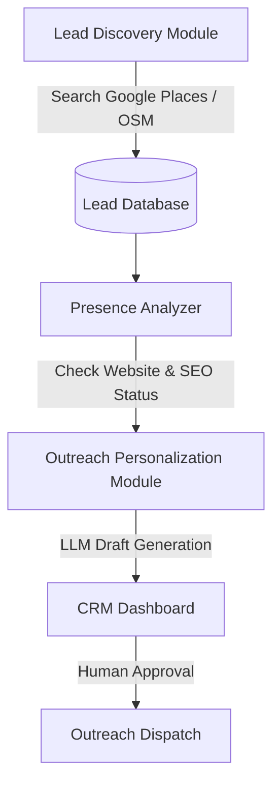
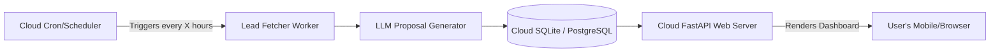

# Blueprint: Local Business Discovery & CRM Outreach Assistant

This document outlines the architecture for a lead generation and outreach assistant targeted at discovering businesses in Bilaspur, analyzing their digital presence (e.g., whether they lack a website or have an outdated one), and preparing personalized outreach proposals.

---

## 1. Compliance & Platform Safety Guidelines

Automating interactive actions on social media platforms (such as automatic following, profile scraping, and direct messaging via automated browser tools like Playwright/Selenium) violates platform Terms of Service (TOS). These unofficial automation techniques trigger automated detection algorithms, resulting in:
* Temporary shadowbans or permanent account suspension.
* IP address blocks or CAPTCHA challenges.
* Potential legal/policy issues regarding unsolicited bulk messaging (spam).

To ensure reliability, longevity, and compliance, this blueprint is designed around:
1. **Official APIs** (such as Google Places API, OpenStreetMap, or official Meta Developer APIs).
2. **Public Data Enrichment** (web scraping public business websites rather than closed social networks).
3. **Human-in-the-Loop Validation** (generating customized message drafts and presenting them on a dashboard for approval and manual dispatch, rather than fully automated headless spamming).

---

## 2. System Architecture

### A. Lead Discovery Module
* **Objective:** Discover local businesses operating in Bilaspur.
* **Sources:**
  * **Google Places API:** Query search terms like `restaurants in Bilaspur`, `clinics in Bilaspur`, `hardware stores in Bilaspur`.
  * **OpenStreetMap (Overpass API):** Extract local nodes tagged with amenities or business offices.
* **Data Fields Extracted:**
  * Business Name
  * Category / Industry
  * Address / Location
  * Phone Number
  * Website URL (if any)
  * Social Media Links (if listed on public directories)

### B. Presence Analyzer
* **Objective:** Analyze each lead's current digital footprint to identify value propositions.
* **Checks:**
  * **Website Check:** Does the business lack a website entirely?
  * **Mobile Friendliness & Performance:** If they have a website, is it responsive, fast, and modern?
  * **SEO / Metadata Audit:** Do they have proper titles, meta descriptions, and Google Business Profile optimization?

### C. Outreach Personalization Module (LLM)
* **Objective:** Draft a highly targeted, warm approach message tailored to the business category and presence analysis.
* **Prompt Strategy:**
  * Provide the LLM with the business name, industry, and specific digital presence gaps (e.g., "lacks website", "site loads in 8 seconds", "not mobile-friendly").
  * Request a polite, professional message offering customized web development services.
  * **Tone:** Helpful, consultative, non-intrusive.

### D. CRM Review Dashboard (User Interface)
* **Objective:** A simple, premium dashboard to manage leads and outreach workflows.
* **Features:**
  * **Lead Board:** Group leads by status (`Discovered`, `Analyzed`, `Draft Ready`, `Contacted`, `Rejected`).
  * **Detail Panel:** Show business location, website audit results, and the generated proposal text.
  * **Action Center:**
    * **Edit Draft:** Allow editing of the AI-generated message.
    * **Send Trigger:** Copy message to clipboard or trigger the official API dispatch.

---

## 3. Technology Stack

* **Backend:** Python (FastAPI / SQLite)
* **Lead Sourcing:** `httpx` + Google Places API or Overpass API
* **Analysis Engine:** Beautiful Soup (for website audits)
* **AI Generation:** OpenAI SDK (calling OpenCode API or GPT models)
* **Frontend:** Vanilla HTML5 / Tailwind CSS or native desktop GUI (e.g., PyQt/Tkinter) for lead management.

---

## 4. Cloud-Based 24/7 Architecture

To operate continuously without depending on a local machine, the assistant is structured to run on cloud infrastructure (e.g., a lightweight Linux VPS like AWS EC2, DigitalOcean, or PythonAnywhere).

### A. Scheduler Module
* The application runs a background scheduler (such as **APScheduler** or a **systemd cron job**) that operates 24/7.
* Tasks are split into separate queues:
  * **Lead Discovery Queue:** Scrapes public directories and maps once daily.
  * **Presence Analysis Queue:** Audits sites incrementally.
  * **Outreach Queue:** Operates during regional business hours (e.g., 9:00 AM to 6:00 PM local time).

---

## 5. Compliance, Evasion Mitigation & Humanized Scheduling

To prevent detection and account bans on social platforms, the workflow incorporates strict behavioral safeguards and humanized throttling patterns.

### A. Non-Linear Scheduling & Jitter
* **Action Jitter:** Instead of executing actions at static intervals (which is easily flagged as bot signature), all tasks execute with random, variable delays (e.g., wait `60 + random(10, 120)` seconds between consecutive actions).
* **Work Rest Cycles:** Simulate natural human rhythms. The agent runs for 45–90 minutes, then enters a "sleep" cycle for 2–4 hours.
* **Volume Limits:** Strict daily caps (e.g., maximum of 15–20 profile visits and 10 DMs sent per 24 hours per account).

### B. Cloud Datacenter IP Protections
* Platforms immediately flag and challenge requests coming from known cloud hosting datacenter IP ranges (AWS, GCP, etc.).
* **Mitigation:**
  * **Residential Proxy Rotation:** If scraping or fetching data directly from social sites, the worker routes requests through residential proxy pools (which appear as standard home internet users).
  * **User-in-the-Loop Webhooks:** Rather than calling unofficial APIs from the cloud, the cloud server generates the message and pushes a notification (e.g., via Telegram or a mobile-friendly CRM button) to your phone. Clicking the button opens the native app with the text pre-copied. This removes all datacenter/automated-browser detection risks entirely, as the final action is performed natively by you.

---

## 6. Next Steps for Implementation

1. **Step 1:** Establish the SQLite database schema for tracking leads, audit results, and proposal histories.
2. **Step 2:** Write the Places API / OpenStreetMap crawler to query local businesses in Bilaspur.
3. **Step 3:** Implement the basic website analyzer to check if websites exist and load correctly.
4. **Step 4:** Integrate LLM proposal drafting and compile a basic web dashboard.
5. **Step 5:** Deploy the backend database and API to a cloud container/VPS and set up APScheduler cron routines.
